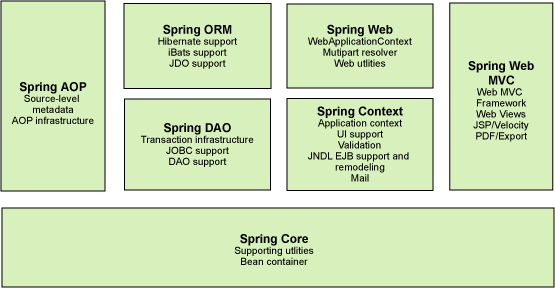

网络
====

常见的Http响应码
----------------

2xx：成功

200：OK,请求成功

201：OK,新的资源建立（post命令）

202：请求被接受，但处理未完成

204：OK，但没有内容返回

\------------------------------------------------------------------------

3xx：重定向：需要用户代理执行更多的动作

301：Moved Permanently永久转移(所请求的资源已被指派为新的固定URL)

302：Found 暂时转移(所请求的资源临时位于另外的URL)

304：文档没有修改（条件GET）

307：Temporary Redirect(临时重定向)

\------------------------------------------------------------------------

4xx：客户差错

400：Bad Request 请求错误

401：Unauthorized 未认证(该请求要求用户认证)

403：Forbidden 不明原因的禁止

404：Not Found 未找到

\------------------------------------------------------------------------

5xx：服务器差错

500：Internal Server Error(服务器错误)

501：没有实现

502：错误的网关(网关或上游服务器来的无效响应)

503：Service Unavailable(一般是访问人数过多)

TCP粘包，拆包
-------------

**出现原因：**

TCP是基于字节流的，虽然应用层和TCP传输层之间的数据交互是大小不等的数据块，但是TCP把这些数据块仅仅看成一连串无结构的字节流，没有边界；另外从TCP的帧结构也可以看出，在TCP的首部没有表示数据长度的字段，基于上面两点，在使用TCP传输数据时，才有粘包或者拆包现象发生的可能。

**发生TCP粘包或拆包有很多原因，现列出常见的几点，可能不全面：**

1、要发送的数据大于TCP发送缓冲区剩余空间大小，将会发生拆包。

2、待发送数据大于MSS（最大报文长度），TCP在传输前将进行拆包。

3、要发送的数据小于TCP发送缓冲区的大小，TCP将多次写入缓冲区的数据一次发送出去，将会发生粘包。

4、接收数据端的应用层没有及时读取接收缓冲区中的数据，将发生粘包。

等等。

**解决方式（解决问题的关键在于如何给每个数据包添加边界信息）：**

1、发送端给每个数据包添加包首部，首部中应该至少包含数据包的长度，这样接收端在接收到数据后，通过读取包首部的长度字段，便知道每一个数据包的实际长度了。

2、发送端将每个数据包封装为固定长度（不够的可以通过补0填充），这样接收端每次从接收缓冲区中读取固定长度的数据就自然而然的把每个数据包拆分开来。

3、可以在数据包之间设置边界，如添加特殊符号，这样，接收端通过这个边界就可以将不同的数据包拆分开。

等等。

跨域与jsonp
-----------

**同源策略**：同源，顾名思义就是同一来源，即访问时只能是协议、域名和端口号相同。

**跨域：**受前面所讲的浏览器同源策略的影响，不是同源的脚本不能操作其他源下面的对象。想要操作另一个源下的对象是就需要跨域。在html中，可以跨域的有\<script\>\等有src属性的标签。

**Jsonp实现跨域：**

利用javascript可以跨域特性，直接为src赋值到请求的jsonp并解析json即可。

JSONP 是 JSON with padding（填充式 JSON 或参数式 JSON）的简写。

JSONP实现跨域请求的原理简单的说，就是动态创建\<script\>标签，然后利用\<script\>的src
不受同源策略约束来跨域获取数据。

JSONP
由两部分组成：回调函数和数据。回调函数是当响应到来时应该在页面中调用的函数。回调函数的名字一般是在请求中指定的。而数据就是传入回调函数中的
JSON 数据。

Spring
======

1.简介　
--------

　　◆目的：解决企业应用开发的复杂性

　　◆功能：使用基本的JavaBean代替EJB，并提供了更多的企业应用功能

　　◆范围：任何Java应用

　　简单来说，Spring是一个轻量级的控制反转(IoC)和面向切面(AOP)的容器框架。

2.轻量　　
----------

从大小与开销两方面而言Spring都是轻量的。完整的Spring框架可以在一个大小只有1MB多的JAR文件里发布。并且Spring所需的处理开销也是微不足道的。此外，Spring是非侵入式的：典型地，Spring应用中的对象不依赖于Spring的特定类。

3.控制反转　　
--------------

Spring通过一种称作控制反转（IoC）的技术促进了**松耦合**。当应用了IoC，一个对象依赖的其它对象会通过**被动的方式传递进来**，而不是这个对象自己创建或者查找依赖对象。你可以认为IoC与JNDI相反——不是对象从容器中查找依赖，而是容器在对象初始化时不等对象请求就主动将依赖传递给它。

http://www.cnblogs.com/xingyukun/archive/2007/10/20/931331.html

4.面向切面　（有待补充）　
--------------

Spring提供了面向切面编程的丰富支持，允许**通过分离应用的业务逻辑**与**系统级服务**（例如审计（auditing）和事务（transaction）管理）进行**内聚性**的开发。应用对象只实现它们应该做的——**完成业务逻辑**——仅此而已。它们并不负责（甚至是意识）其它的系统级关注点，例如日志或事务支持。

实现方式：

>   全自动代理

>   纵向继承，横向抽取(spring aop)

>   代理模式：jdk动态代理------\>new ProxyInstance()
>   InvocationHandler(Invoke方法)

>   cglib字节码增强---\>enhancer.setSuperclass()

>   .setCallback()//设置回调方法

>   .create()//创建代理对象

>   通知：前置，后置，环绕，抛出异常，最终通知

| Spring AOP                                       | AspectJ                                                      |
| :----------------------------------------------- | :----------------------------------------------------------- |
| 在纯 Java 中实现                                 | 使用 Java 编程语言的扩展实现                                 |
| 不需要单独的编译过程                             | 除非设置 LTW，否则需要 AspectJ 编译器 (ajc)                  |
| 只能使用运行时织入                               | 运行时织入不可用。支持编译时、编译后和加载时织入             |
| 功能不强-仅支持方法级编织                        | 更强大 - 可以编织字段、方法、构造函数、静态初始值设定项、最终类/方法等......。 |
| 只能在由 Spring 容器管理的 bean 上实现           | 可以在所有域对象上实现                                       |
| 仅支持方法执行切入点                             | 支持所有切入点                                               |
| 代理是由目标对象创建的, 并且切面应用在这些代理上 | 在执行应用程序之前 (在运行时) 前, 各方面直接在代码中进行织入 |
| 比 AspectJ 慢多了                                | 更好的性能                                                   |
| 易于学习和应用                                   | 相对于 Spring AOP 来说更复杂                                 |

5.容器　　
----------

Spring包含并管理应用对象的配置和生命周期，在这个意义上它是一种容器，你可以配置你的每个bean如何被创建——基于一个可配置原型（prototype），你的bean可以创建一个单独的实例或者每次需要时都生成一个新的实例——以及它们是如何相互关联的。然而，Spring不应该被混同于传统的重量级的EJB容器，它们经常是庞大与笨重的，难以使用。

6.框架　　
----------

Spring可以将简单的组件配置、组合成为复杂的应用。在Spring中，应用对象被声明式地组合，典型地是在一个XML文件里。Spring也提供了很多基础功能（事务管理、持久化框架集成等等），将应用逻辑的开发留给了你。

所有Spring的这些特征使你能够编写更干净、更可管理、并且更易于测试的代码。它们也为Spring中的各种模块提供了基础支持。

模块：
------

常用三种注入
------------

### 构造方法注入

>   1.把UserDaoJdbc通过constructor-arg标签注入到UserService的某个有参数的构造方法如下

>   spring注入bean的常用三种方法

### setter注入

实现配置文件如下方法代码

### **3. 基于注解的注入**

### 自动注入：

ByName	ByType	constructor	no	default	autodetect

事务几种实现方式
----------------

（1）编程式事务管理对基于 POJO的应用来说是唯一选择。我们需要在代码中调用beginTransaction()、commit()、rollback()等事务管理相关的方法，这就是编程式事务管理。

（2）基于 TransactionProxyFactoryBean的声明式事务管理

（3）基于@Transactional 的声明式事务管理

（4）基于Aspectj AOP配置事务

Springboot
----------

### 简介：

SpringBoot是一个框架，一种全新的编程规范，他的产生简化了框架的使用，所谓简化是指简化了Spring众多框架中所需的大量且繁琐的配置文件，所以SpringBoot是一个服务于框架的框架，服务范围是简化配置文件。

***Controller使用threadlocal实现线程安全***。

### 热部署

orm（object relational mappering 对象关系映射）框架：
=====================================================

### mybatis好处：

#### 原生JDBC缺点：

1、数据库连接，使用时就创建，不使用立即释放，对数据库进行频繁连接开启和关闭，造成数据库资源浪费，影响数据库性能。

解决方案：使用数据库连接池管理数据库连接。

2、将sql语句硬编码到java代码中，如果sql
语句修改，需要重新编译java代码，不利于系统维护。

解决方案：将sql语句配置在xml配置文件中，即使sql变化，不需要对java代码进行重新编译。

3、向preparedStatement中设置参数，对占位符号位置和设置参数值，硬编码在java代码中，不利于系统维护。

解决方案：将sql语句及占位符号和参数全部配置在xml中。

4、从resutSet中遍历结果集数据时，存在硬编码，将获取表的字段进行硬编码，，不利于系统维护。

解决方案：将查询的结果集，自动映射成java对象。

#### Mybatis好处：

MyBatis是一个优秀的持久层框架，它对jdbc的操作数据库的过程进行封装，使开发者只需要关注
SQL本身，而不需要花费精力去处理例如注册驱动、创建connection、创建statement、手动设置参数、结果集检索等jdbc繁杂的过程代码。

　　Mybatis通过xml或注解的方式将要执行的各种statement（statement、preparedStatemnt、CallableStatement）配置起来，并通过java对象和statement中的sql进行映射生成最终执行的sql语句，最后由mybatis框架执行sql并将结果映射成java对象并返回。

#### \$与\#

1 \#是将传入的值当做字符串的形式，eg:select id,name,age from student where id
=\#{id},当前端把id值1，传入到后台的时候，就相当于 select id,name,age from
student where id ='1'.

 2 \$是将传入的数据直接显示生成sql语句，eg:select id,name,age from student where
id =\${id},当前端把id值1，传入到后台的时候，就相当于 select id,name,age from
student where id = 1.

 3 使用\#可以很大程度上防止sql注入。(语句的拼接)

 4 但是如果使用在order by 中就需要使用 \$.

 5 在大多数情况下还是经常使用\#，但在不同情况下必须使用\$. 

#### 分页方式：

**数组分页**：先查出所有的数据存到list中，然后在截取。（类似于RowBounds）

**Sql分页**：mysql使用limit以及优化（博客<https://blog.csdn.net/sjs_caomei/article/details/89303057>）

**拦截器分页**：

**RowBounds**：RowBounds在处理分页时，只是简单的把offset之前的数据都skip掉，超过limit之后的数据不取出，上图中的代码取自MyBatis中的DefaultResultSetHandler类。跳过offset之前的数据是由方法skipRows处理，判断数据是否超过了limit则是由shouldProcessMoreRows方法进行判断。简单点说道，就是先把数据全部查询到ResultSet，然后从ResultSet中取出offset和limit之间的数据，这就实现了分页查询。

#### 延迟加载（懒加载）

1.  延迟加载的含义： 用到的时候才会去进行相关操作

2.  延迟加载的例子：

    2.1 spring的BeanFactory，在getBean（）的时候才创建Bean

1.  物理分页查询，只有点击某一页时采取数据库查询该页的数据

2.  类中属性含有类，查询时结果映射可以是懒加载

3.原理（未完成）：

#### 缓存

**一级缓存：**MyBatis 默认开启了一级缓存，一级缓存是在SqlSession层面进行缓存的。即，同一个SqlSession
，多次调用同一个Mapper和同一个方法的同一个参数，只会进行一次数据库查询，然后把数据缓存到缓冲中，以后直接先从缓存中取出数据，不会直接去查数据库。

但是不同的SqlSession对象，因为不用的SqlSession都是相互隔离的，所以相同的Mapper、参数和方法，他还是会再次发送到SQL到数据库去执行，返回结果。

**二级缓存：**克服不同sqlSession对象做同一操作多次查询的问题

详情：<https://www.cnblogs.com/moongeek/p/7689683.html>

#### 执行器

**SimpleExecutor：**每执行一次update或select，就开启一个Statement对象，用完立刻关闭Statement对象。

**ReuseExecutor：**执行update或select，以sql作为key查找Statement对象，存在就使用，不存在就创建，用完后，不关闭Statement对象，而是放置于Map内，供下一次使用。简言之，就是重复使用Statement对象。

**BatchExecutor：执行update（没有select，JDBC批处理不支持select），将所有sql都添加到批处理中（addBatch()），等待统一执行（executeBatch()），它缓存了多个Statement对象，每个Statement对象都是addBatch()完毕后，等待逐一执行executeBatch()批处理。与JDBC批处理相同。**

**CachingExecutor：缓存执行器相对于其他执行器的差别在于，首先是在query()方法中判断是否使用二级缓存(也就是mapper级别的缓存)。虽然mybatis默认启用了CachingExecutor，但是如果在mapper层面没有明确设置二级缓存的话，就退化为SimpleExecutor了。二级缓存的维护由TransactionalCache(事务化缓存)负责，当在TransactionalCacheManager(事务化缓存管理器)中调用putObject和removeObject方法的时候并不是马上就把对象存放到缓存或者从缓存中删除，而是先把这个对象放到entriesToAddOnCommit和entriesToRemoveOnCommit这两个HashMap之中的一个里，然后当执行commit/rollback方法时再真正地把对象存放到缓存或者从缓存中删除，具体可以参见TransactionalCache.commit/rollback方法。**

**还有一个差别是使用了TransactionalCacheManager管理事务，其他逻辑就一样了。**

**概念：**

所有我们在应用层通过sqlSession执行的各类selectXXX和增删改操作在做了动态sql和参数相关的封装处理后，都被委托给具体的执行器去执行，包括一、二级缓存的管理，事务的具体管理，Statement和具体JDBC层面优化的实现等等。所以执行器比较像是sqlSession下的各个策略工厂实现，用户通过配置决定使用哪个策略工厂。只不过执行器在一个mybatis配置下只有一个，这可能无法适应于所有的情况。

分布式业务
==========

微服务架构
----------

### 为什么使用微服务

单一架构模式在项目初期很小的时候开发方便，测试方便，部署方便，运行良好。可是当应用随着时间的推进，加入的功能越来越多，最终会变得巨大，一个项目中很有可能数百万行的代码，互相之间繁琐的jar包。

1、
不再适用敏捷开发，过于复杂，任何开发者都不能够完全理解，修复漏洞和实现新功能变得困难和耗时。

2、
规模越大，启动时间越长，自然会拖慢开发进度，一个小功能的修改部署起来变得困难，必须重新部署整个应用。

3、
系统的不同的模块的需要不同的特定的虚拟机环境时，由于是整体应用，那么只能折中选择。

4、 任意模块的漏洞或者错误都会影响这个应用，降低系统的可靠性

5、 还有一个如果想整体应用采用新的技术，新的框架或者语言，那是不可能的。

如果采用微服务架构模式，则可以解决单一架构模式带来的系统复杂性。主要包括以下几个好处：

1、
由于每个服务都是独立并且微小的，由单独的团队负责，仍然可以采用敏捷开发模式，自由的选择合适的技术，甚至可以重写老服务，当然都要遵守统一的API约定。

2、
每一个微服务都是独立部署的，可以进行快速迭代部署，根据各自服务需求选择合适的虚拟机和使用最匹配的服务资源要求的硬件。

3、
整体应用程序被分解成可管理的模块和服务，单个的服务可以更快的开发、更简单的理解和维护。

4、
一些需要进行负载均衡的服务可以部署在多个云虚拟机上，加入NGINX这样的负载均衡器在多个实例之间分发请求，这样不需要整个应用进行负载均衡了。

每个后端服务暴露一套REST
API，大部分服务调用其他服务提供的API。每个服务都有自己的数据库模式，而不是共享单个数据库模式。尽管这会造成某些数据的冗余，但是对于微服务架构这个独立数据库模式是必要的，确保了独立服务之间的松散耦合。

### 问题思考：

高可用、高并发、高性能

1.客户端如何访问那么多服务？

APIGATEWAY（客户端网关）

2.服务之间如何通信

同步通信

http（apache http client）

rpc（dubbo）

异步通信

消息队列（kafka、MQ）

3.如何管理服务

服务治理

服务的注册与发现（基于客户端的注册与发现 Zookeeper）

### Zookeeper

读写分离（主写从读）的分布式程序协调服务

Zookeeper事件通知

Watcher机制：异步通知机制（当一个znode被删除或者增加的时候，watcher会异步通知zkclient）

ZooKeeper 的 Watcher 机制主要包括客户端线程、客户端 WatchManager 和 ZooKeeper
服务器三部分。在具体工作流程上，简单地讲，客户端在向 ZooKeeper 服务器注册
Watcher 的同时，会将 Watcher 对象存储在客户端的 WatchManager 中。当 ZooKeeper
服务器端触发 Watcher 事件后，会向客户端发送通知，客户端线程从 WatchManager
中取出对应的 Watcher 对象来执行回调逻辑。如清单 9 所示，WatchManager 创建了一个
HashMap，这个 HashMap 被用来存放 Watcher 对象。

服务的注册与发现服务器

一致性（顺序一致性）：

ZAB协议：

1.  集群崩溃恢复（当主节点挂掉后如何选举主节点）

>   fast
>   paxos流程是在选举过程中，某Server首先向所有Server提议自己要成为leader，当其它Server收到提议以后，解决epoch和
>   zxid的冲突，并接受对方的提议，然后向对方发送接受提议完成的消息，重复这个流程，最后一定能选举出Leader。

1.  数据同步（如何实现个节点的数据同步问题）

>   ZAB 的数据写入涉及到 Broadcast 阶段，简单来说，就是 Zookeeper
>   常规情况下更新数据的时候，由 Leader 广播到所有的 Follower。其过程如下：

>   客户端发出写入数据请求给任意 Follower。

>   Follower 把写入数据请求转发给 Leader。

>   Leader 采用二阶段提交方式，先发送 Propose 广播给 Follower。

>   Follower 接到 Propose 消息，写入日志成功后，返回 ACK 消息给 Leader。

>   Leader 接到半数以上ACK消息，返回成功给客户端，并且广播 Commit 请求给
>   Follower

>   https://s4.51cto.com/oss/201809/12/5e245feb8f8311195763d2abb3e27c20.jpg

分布式存储
==========

高并发处理的思路与手段
======================

扩容
----

水平扩容：提高系统部件能力

垂直扩容：增加系统成员

数据库
------

**读写操作扩展：**

读操作扩展：memcache、redis、cdn等缓存（注意缓存应达到一致性）

### 缓存的常见问题：

#### 1、缓存穿透：

当业务系统需要查询的数据根本在数据库中不存在时，每一次的查询请求都会最终对数据库造成一次查询，这种情况称为缓存穿透，即**业务访问根本不存在的数据**。

危害：这种情况下，如果有大量的请求查询根本不存在的数据，那么这些请求将直接对数据库造成冲击，会使得数据库压力很大。大多数情况下为恶意攻击，故意营造大量不存在的数据请求我们的服务，由于缓存中并不存在这些数据，因此海量请求均落在数据库中，从而可能会导致数据库崩溃。

解决方案：1、缓存空数据：即将空数据null也做成一个缓存结果，这样在下次有相同请求到来时，缓存可以拦截该请求，返回缓存中的结果。2、使用BloomFilter，它需要在缓存之前再加一道屏障，里面存储目前数据库中存在的所有key。当业务系统有查询请求的时候，首先去BloomFilter中查询该key是否存在。若不存在，则说明数据库中也不存在该数据，因此缓存都不要查了，直接返回null。若存在，则继续执行后续的流程，先前往缓存中查询，缓存中没有的话再前往数据库中的查询。

#### 2、缓存雪崩：

如果缓存在某个时刻挂了，那么大量的请求也将会直接访问数据库，造成很大压力。

危害：如果缓存因某种原因发生了宕机，那么原本被缓存抵挡的海量查询请求就会像疯狗一样涌向数据库。此时数据库如果抵挡不了这巨大的压力，它就会崩溃。

解决方案：1、使用缓存集群，增大可用性，当一个缓存挂了还有其他的缓存跟上。2、使用Hystrix，它是一款开源的“防雪崩工具”，它通过熔断、降级、限流三个手段来降低雪崩发生后的损失。

写操作扩展：Cassandra、Hbase等

减轻数据库量级

**切库**：读写分离（master可用来处理写读或者实时信息的处理，slaver主要用来读）

**分表**：

横向：表并不多，但每张表的数据非常多，这时候适合水平切分，即把表的数据按某种规则（比如按ID散列）切分到多个数据库(server)上。

纵向：因为表多而数据多，这时候适合使用垂直切分，即把关系紧密（比如同一模块）的表切分出来放在一个server上。

消息队列处理
------------

特性：与业务无关：只做消息分发

FIFO：先投递先到达

容灾：节点的动态增删和消息的持久化

性能：吞吐量的提高

好处：业务解耦

最终一致性

广播

错峰与流控

应用拆分
----------

原因：【生产】和【消费】的速度或稳定性等因素不一致

原则：业务优先

循序渐进

兼顾技术

可靠测试

应用之间通信：rpc（实时性），消息队列

应用之间数据库的设计：每个应用都有独立的数据库

避免事务操作跨应用

应用限流
--------

算法：

计数算法 漏桶

滑动窗口 令牌桶

其他：服务降级与服务熔断

当请求过多时异常后，设置统一的返回异常

高可用的手段：
--------------

主备切换：apache curator + ZK的分布式锁

监控报警系统

分布式任务调度系统：elastic-job + ZK

# 消息队列

## 各大消息队列的对比

| 特性                    | ActiveMQ                                                     | RabbitMQ（erlang）                                           | RocketMQ（阿里，java）                                       |                            kafka                             |
| ----------------------- | ------------------------------------------------------------ | ------------------------------------------------------------ | ------------------------------------------------------------ | :----------------------------------------------------------: |
| 单机吞吐量              | 万级，吞吐量比RocketMQ和Kafka要低了一个数量级                | 万级，吞吐量比RocketMQ和Kafka要低了一个数量级                | 10万级，RocketMQ也是可以支撑高吞吐的一种MQ                   | 10万级别，这是kafka最大的优点，就是吞吐量高。一般配合大数据类的系统来进行实时数据计算、日志采集等场景 |
| topic数量对吞吐量的影响 |                                                              |                                                              | topic可以达到几百，几千个的级别，吞吐量会有较小幅度的下降这是RocketMQ的一大优势，在同等机器下，可以支撑大量的topic | topic从几十个到几百个的时候，吞吐量会大幅度下降所以在同等机器下，kafka尽量保证topic数量不要过多。如果要支撑大规模topic，需要增加更多的机器资源 |
| 时效性                  | ms级                                                         | 微秒级，这是rabbitmq的一大特点，延迟是最低的                 | ms级                                                         |                        延迟在ms级以内                        |
| 可用性                  | 高，基于主从架构实现高可用性                                 | 高，基于主从架构实现高可用性                                 | 非常高，分布式架构                                           | 非常高，kafka是分布式的，一个数据多个副本，少数机器宕机，不会丢失数据，不会导致不可用 |
| 消息可靠性              | 有较低的概率丢失数据                                         |                                                              | 经过参数优化配置，可以做到0丢失                              |             经过参数优化配置，消息可以做到0丢失              |
| 功能支持                | MQ领域的功能极其完备                                         | 基于erlang开发，所以并发能力很强，性能极其好，延时很低       | MQ功能较为完善，还是分布式的，扩展性好                       | 功能较为简单，主要支持简单的MQ功能，在大数据领域的实时计算以及日志采集被大规模使用，是事实上的标准 |
| 优劣势总结              | 非常成熟，功能强大，在业内大量的公司以及项目中都有应用偶尔会有较低概率丢失消息而且现在社区以及国内应用都越来越少，官方社区现在对ActiveMQ 5.x维护越来越少几个月才发布一个版本而且确实主要是基于解耦和异步来用的，较少在大规模吞吐的场景中使用 | erlang语言开发，性能极其好，延时很低；吞吐量到万级，MQ功能比较完备而且开源提供的管理界面非常棒，用起来很好用社区相对比较活跃，几乎每个月都发布几个版本分在国内一些互联网公司近几年用rabbitmq也比较多一些但是问题也是显而易见的，RabbitMQ确实吞吐量会低一些，这是因为他做的实现机制比较重。而且erlang开发，国内有几个公司有实力做erlang源码级别的研究和定制？如果说你没这个实力的话，确实偶尔会有一些问题，你很难去看懂源码，你公司对这个东西的掌控很弱，基本职能依赖于开源社区的快速维护和修复bug。而且rabbitmq集群动态扩展会很麻烦，不过这个我觉得还好。其实主要是erlang语言本身带来的问题。很难读源码，很难定制和掌控。 | 接口简单易用，而且毕竟在阿里大规模应用过，有阿里品牌保障日处理消息上百亿之多，可以做到大规模吞吐，性能也非常好，分布式扩展也很方便，社区维护还可以，可靠性和可用性都是ok的，还可以支撑大规模的topic数量，支持复杂MQ业务场景而且一个很大的优势在于，阿里出品都是java系的，我们可以自己阅读源码，定制自己公司的MQ，可以掌控社区活跃度相对较为一般，不过也还可以，文档相对来说简单一些，然后接口这块不是按照标准JMS规范走的有些系统要迁移需要修改大量代码还有就是阿里出台的技术，你得做好这个技术万一被抛弃，社区黄掉的风险，那如果你们公司有技术实力我觉得用RocketMQ挺好的 | kafka的特点其实很明显，就是仅仅提供较少的核心功能，但是提供超高的吞吐量，ms级的延迟，极高的可用性以及可靠性，而且分布式可以任意扩展同时kafka最好是支撑较少的topic数量即可，保证其超高吞吐量而且kafka唯一的一点劣势是有可能消息重复消费，那么对数据准确性会造成极其轻微的影响，在大数据领域中以及日志采集中，这点轻微影响可以忽略这个特性天然适合大数据实时计算以及日志收集 |

## 名词解释

### topic

Topic是消息中间件里一个重要的概念，每一个Topic代表了一类消息，有了多个Topic，就可以对消息进行归类与隔离。

可以参照下图的动物园喂食模型，每一种动物都只能消费相对应的食品。

### 分区

Kafka和RocketMQ都是磁盘消息队列的模式，对于同一个消费组，一个分区只支持一个消费线程来消费消息。过少的分区，会导致消费速度大大落后于消息的生产速度。所以在实际生产环境中，一个Topic会设置成多分区的模式，来支持多个消费者，参照下图：

### 分布式

将一个业务划分为多个子业务，分工合作完成大业务。每个子业务部署在不同服务器上，缩短单个任务处理使时间达到响应时间短的功能。

### 集群

多台服务器部署多个相同的业务，共同处理多个请求，达到响应时间短的功能。

### 主从

拥有master，slaver。实现在集群上，一般作用于数据的同步。master与slaver对数据进行不同的处理功能，如zookeeper的读写分离。

## 消息中间件的作用

### 系统解耦

举例：一个核心数据，多个系统需要调用

解耦方式：核心数据加入到mq中（可以使用topic+分区），各系统向mq中取数据即可。

### 异步调用

举例：当一个业务链式处理逻辑功能的时候，有部分业务耗时拖慢系统性能。

解耦方式：当一个业务不需要及时处理的时候（花费时间会相对较长，链式处理会拖慢系统性能），加入mq，后续时间在慢慢处理。

### 流量削峰

举例：每秒请求业务量平时不是很大，但到特定时间会有高流量访问，使用分布式或者集群有点浪费

解决办法：流量请求时直接加入mq，服务器再从mq中取数据。