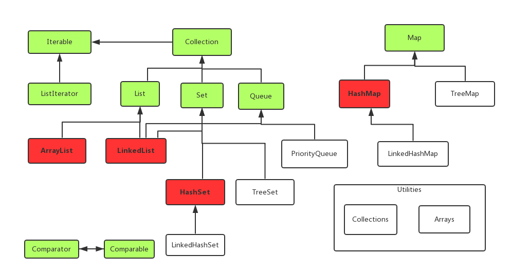

Jdk与jre
========

Jdk（java development kit）
---------------------------

java开发工具包，是程序员使用java语言编写java程序所需的开发工具包，是提供给程序员使用的。JDK包含了JRE，同时还包含了编译java源码的编译器javac，还包含了很多java程序调试和分析的工具：jconsole，jvisualvm等工具软件，还包含了java程序编写所需的文档和demo例子程序。

Jre（java runtime environment）
-------------------------------

JRE顾名思义是java运行时环境，包含了java虚拟机，java基础类库。是使用java语言编写的程序运行所需要的软件环境，是提供给想运行java程序的用户使用的。

另外，安装JRE的时候安装程序会自动把JRE的java.exe添加到了系统变量中。系统变量Path的最前面有%SystemRoot%system32;%SystemRoot%;这样的配置，那样到Windows/system32目录下main去看看，会发现一个java.exe文件。这样就无需配置环境变量，也可以运行Java程序了。Jdk有javac。

JDK与JRE的区别
--------------

JDK是Java的开发工具，它不仅提供了Java程序运行所需的JRE，还提供了一系列的编译，运行等工具，如javac，java，javaw等。JRE只是Java程序的运行环境，它最核心的内容就是JVM（Java虚拟机）及核心类库。

Object类
========

是所有类的父类。一个类默认继承object类

常用方法
--------

### **toString() **

### 默认输出对象地址

### hashCode 与 equals (重要)

面试官可能会问你：“你重写过 hashcode 和 equals 么，为什么重写equals时必须重写hashCode方法？”

#### hashCode（）介绍

hashCode() 的作用是获取哈希码，也称为散列码；它实际上是返回一个int整数。这个哈希码的作用是确定该对象在哈希表中的索引位置。hashCode() 定义在JDK的Object.java中，这就意味着Java中的任何类都包含有hashCode() 函数。

散列表存储的是键值对(key-value)，它的特点是：能根据“键”快速的检索出对应的“值”。这其中就利用到了散列码！（可以快速找到所需要的对象）

#### 为什么要有 hashCode

我们以“HashSet 如何检查重复”为例子来说明为什么要有 hashCode：

当你把对象加入 HashSet 时，HashSet 会先计算对象的 hashcode 值来判断对象加入的位置，同时也会与其他已经加入的对象的 hashcode 值作比较，如果没有相符的hashcode，HashSet会假设对象没有重复出现。但是如果发现有相同 hashcode 值的对象，这时会调用 equals（）方法来检查 hashcode 相等的对象是否真的相同。如果两者相同，HashSet 就不会让其加入操作成功。如果不同的话，就会重新散列到其他位置。（摘自我的Java启蒙书《Head first java》第二版）。这样我们就大大减少了 equals 的次数，相应就大大提高了执行速度。

#### hashCode（）与equals（）的相关规定

如果两个对象相等，则hashcode一定也是相同的

两个对象相等,对两个对象分别调用equals方法都返回true

两个对象有相同的hashcode值，它们也不一定是相等的

因此，equals 方法被覆盖过，则 hashCode 方法也必须被覆盖

hashCode() 的默认行为是对堆上的对象产生独特值。如果没有重写 hashCode()，则该 class 的两个对象无论如何都不会相等（即使这两个对象指向相同的数据）

### clone()

浅拷贝：创建一个新对象，然后将当前对象的非静态字段复制到该对象，如果字段类型是值类型（基本类型）的，那么对该字段进行复制；如果字段是引用类型的，则只复制该字段的引用而不复制引用指向的对象。此时新对象里面的引用类型字段相当于是原始对象里面引用类型字段的一个副本，原始对象与新对象里面的引用字段指向的是同一个对象。即 拷贝引用字段的引用（c语言即指针拷贝，指向同一地址），其他都是两份内容的拷贝。

深拷贝：即将引用类型的属性内容也拷贝一份新的。即指针指向不同的地址，地址值不相等。（实现：序列化、重写clone（） ）

**Wait() notify() notifyAll()**

# reference 类型

在日常的java开发中，我们很多时候都是通过以下方式创建对象和引用

```
Person person = new Person()
```

这里创建的就是一个强引用，那么有人就会说了，难道还有其他类型的引用，答案是肯定的，在java中包含四种类型的引用

### 一、强引用

如上所叙述，这种直接创建引用的都属于强引用，生命周期，引用与对象的指向关系没有去掉之前，对象在gc阶段不能被回收

### 二、弱引用

相对与强引用来说，弱引用在gc阶段，引用所指向的对象将被强制的回收

弱引用的创建方式

```
public static void main(String[] args) {

    WeakReference<Integer> weakRef = new WeakReference(128);
    System.out.println("GC前："+weakRef.get());
    System.gc();
    System.out.println("GC后："+weakRef.get());
}
```

上述代码的运行结果：

> GC前：128
> GC后：null

由此我们可以看到，执行了System.gc操作，弱引用的对象已经被回收了，注意：这里之所以用128，因为对于整数来说，**-128～127的值使用的是缓存里的值，不会被回收**

### 三、软引用

软引用只会在内存不足的情况下才会进行回收，如果内存充足，则不回收

用例如下：

```
public static void main(String[] args) {
    //定义一个软引用列表
    List<SoftReference<Integer>> softList = new ArrayList<>();

    for(int i=0;i<5000;i++){
        softList.add(new SoftReference<Integer>(new Integer(i)));
    }
    //存活的引用数
    int activeRefNum = 0;
    for(SoftReference softRef:softList){
        if(softRef.get()!=null){
            activeRefNum++;
        }
    }

    System.out.println("当前存活的引用数："+activeRefNum);

    List list = new ArrayList();
    for(int i=0;i<10000;i++){
        list.add(i);
    }

    activeRefNum = 0;
    for(SoftReference softRef:softList){
        if(softRef.get()!=null){
            activeRefNum++;
        }
    }

    System.out.println("当前存活的引用数："+activeRefNum);
}
```

当内存充足的情况下执行结果如下

> GC前存活的软引用数：5000
> GC后存活的软引用数：5000

当设置jvm 运行参数为 `-Xms1m -Xmx1m`，执行结果如下：

> GC前存活的软引用数：5000
> GC后存活的软引用数：0

### 四、虚引用

虚引用，一种较为特殊的引用，该引用不能拿来存值，当你创建了虚引用以后，你不能通过get方法来获取值，相当于没有引用，这个引用主要可以拿来作为监控使用，因为当垃圾回收器确定回收对象的时候，会把引用放入到ReferenceQueue中，可以通过poll queue获取当前要被回收的引用对象

jvm参数：`-Xms5m -Xmx5m`

```
public static void main(String[] args) {
    final ReferenceQueue queue = new ReferenceQueue();

    PhantomReference<Integer> phantomRef = new PhantomReference<>(128,queue);

    //start一个线程进行监控
    new Thread(new Runnable() {
        @Override
        public void run() {
            while(true) {
                Reference ref = queue.poll();
                if(ref!=null){
                    System.out.println("--- 虚引用对象被jvm回收了 ----");
                    System.exit(1);
                }
            }
        }
    }).start();

    //初始化一个list，不停的添加数据，出发jvm gc
    List list = new ArrayList();
    new Thread(new Runnable() {
        @Override
        public void run() {
            while (true) {
                list.add(new byte[1024 * 50]);
                try {
                    Thread.sleep(1000);
                } catch (InterruptedException e) {
                    e.printStackTrace();
                }
                System.out.println("phantomRef的referent："+phantomRef.get());
            }
        }
    }).start();
}
```

执行结果如下：

> phantomRef的referent：null
> phantomRef的referent：null
> phantomRef的referent：null
> --- 虚引用对象被jvm回收了 ----


字符串类
========

string
------

1，Stirng对象不是基本数据类型

2，String是final类，不能被继承。是不可变对象，一旦创建，就不能修改它的值。

3，对于已经存在的Stirng对象，修改它的值，就是重新创建一个对象，然后将新值赋予这个对象

stringBuffer
------------

　　 1，一个类似于 String
的字符串缓冲区，对它的修改的不会像String那样重创建对象。

　　 2，使用append()方法修改Stringbuffer的值，使用toString()方法转换为字符串。
	     3，使用synchronized，是线程安全的。

stringBuild
-----------

是jdk1.5后用来替换stringBuffer的一个类，大多数时候可以替换StringBuffer。和StringBuffer的区别在于Stringbuild是一个单线程使用的类，不过执行线程同步所以比StringBuffer的速度快，效率高。是线程非安全的

## **String s="abc"及String s=new String("abc")问题**

String a="abc"，这行代码被执行的时候，JAVA虚拟机首先在**字符串池**中查找是否已经存在了值为"abc"的这么一个对象，它的判断依据是String类equals(Object obj)方法的返回值。如果有，则不再创建新的对象，将使用串池里原来的那个内存，直接返回已存在对象的引用，而不会重新分配内存；如果没有，则先创建这个对象，然后把它加入到字符串池中，再将它的引用返回。

而如果用String s=new String("abc")，不管串池里有没有"abc"，它都会在**堆**中重新分配一块内存，定义一个新的对象


IO流
====


网络编程
========

Bio
---

同步阻塞模型，服务端提供IP和监听端口，客户端通过连接操作向服务端监听的地址发起连接请求。采用BIO通信模型的服务端，通常由一个独立的Acceptor线程负责监听客户端的连接，它接收到客户端连接请求之后为每个客户端创建一个新的线程进行链路处理没处理完成后，通过输出流返回应答给客户端，线程销毁。即典型的一请求一应答通宵模型。（线程池实现m:n？）

Nio
---

同步非阻塞I/O：java使用选择器（Selector）。Selector提供选择已经就绪的任务的能力：Selector会不断轮询注册在其上的Channel（负责从缓存区读写数据），如果某个Channel上面发生读或者写事件，这个Channel就处于就绪状态，会被Selector轮询出来，然后通过SelectionKey可以获取就绪Channel的集合，进行后续的I/O操作。

因为应答消息的发送，SocketChannel也是异步非阻塞的，所以不能保证一次能把需要发送的数据发送完，此时就会出现写半包的问题。我们需要注册写操作，不断轮询Selector将没有发送完的消息发送完毕，然后通过Buffer的hasRemain()方法判断消息是否发送完成。


Aio
---

异步非阻塞（**AIO的做法是，每个水壶上装一个开关，当水开了以后会提醒对应的线程去处理。**）

NIO是同步的IO，是因为程序需要IO操作时，必须获得了IO权限后亲自进行IO操作才能进行下一步操作。AIO是对NIO的改进（所以AIO又叫NIO.2），它是基于Proactor模型的。每个socket连接在事件分离器注册IO完成事件 和
IO完成事件处理器。程序需要进行IO时，向分离器发出IO请求并把所用的Buffer区域告知分离器，分离器通知操作系统进行IO操作，操作系统自己不断尝试获取IO权限并进行IO操作（数据保存在Buffer区），操作完成后通知分离器；分离器检测到IO完成事件，则激活IO完成事件处理器，处理器会通知程序说“IO已完成”，程序知道后就直接从Buffer区进行数据的读写。

AIO是发出IO请求后，由操作系统自己去获取IO权限并进行IO操作；NIO则是发出IO请求后，由线程不断尝试获取IO权限，获取到后通知应用程序自己进行IO操作。

### Files

文件的IO操作

<https://www.jianshu.com/p/3cb5ca04e3c8>

容器
====



HashSet 基于 HashMap 实现的；

Collections(集合工具类)
-----------------------

1.  排序(Sort)
2.  混排（Shuffling）
3.  反转(Reverse)
4.  替换所以的元素(Fill)
5.  拷贝(Copy)
6.  返回Collections中最小元素(min)
7.  返回Collections中最大元素(max)
8.  lastIndexOfSubList返回指定源列表中最后一次出现指定目标列表的起始位置


## Guava（待补充//）

hashmap Hashset
---------------

HashMap有4个构造器，其他构造器如果用户没有传入**initialCapacity**
和**loadFactor**这两个参数，会使用默认值

initialCapacity默认为16，loadFactory默认为0.75


Java7之前如上图，java8之后，如果链表长度大于8，则变成红黑树

**为什么是8？**

红黑树的平均查找长度是log(n)，长度为8，查找长度为log(8)=3，链表的平均查找长度为n/2，当长度为8时，平均查找长度为8/2=4，这才有转换成树的必要；链表长度如果是小于等于6，6/2=3，虽然速度也很快的，但是转化为树结构和生成树的时间并不会太短。

还有选择6和8的原因是：

中间有个差值7可以防止链表和树之间频繁的转换。假设一下，如果设计成链表个数超过8则链表转换成树结构，链表个数小于8则树结构转换成链表，如果一个HashMap不停的插入、删除元素，链表个数在8左右徘徊，就会频繁的发生树转链表、链表转树，效率会很低。

多线程
======

Java并发编程
------------

并行：多个cpu同时运行

并发：多个线程操作相同的资源，保证线程的安全性

高并发：同时处理很多请求，提高程序性能。

进程：给个程序被调度到内存运行，就是一个进程

线程：进程里的一个小任务

### **Jmm**（java内存模型）：

其里面的八个操作都具备原子性


### 线程的安全性

原子性：操作是整体性的，不可再分。也可以说同一时刻只能有一个线程进行访问，错做不可分。

可见性：一个线程对一个线程的共享变量的修改对于另一个线程来说是可以见到的。

有序性：happens-before原则

1.  程序次序规则：一个线程内，按照代码顺序，（看起来）书写在前面的的操作先行发生与书写在后面的操做

2.  锁定规则：一个unlock操作先行发生于后面对同一个锁的lock操作

3.  Volatile变量规则：写先发生与读（对于同一个变量）

4.  传递规则：如果A\<B B\<C，那么 A\<C（\<:表示先于）

#### Synchronized

修饰代码块：

根据虚拟机规范要求，在执行monitorenter指令时，首先要尝试获取对象锁，也就是monitor对象。如果这个对象没有被锁定，或者当前线程已经拥有了这个对象的锁，那么就把锁的计数器（_count）加1。当然与之对应执行monitorexit指令时，锁的计数器（_count）也会减1。第二个monitorexit为异常时运行，确保每个+1都有一个-1对应。如下图所示：


如下图所示，从反编译的结果来看，方法的同步并没有通过指令monitorenter和monitorexit来完成（理论上其实也可以通过这两条指令来实现），不过相对于普通方法，其常量池中多了ACC_SYNCHRONIZED标示符。JVM就是根据该标示符来实现方法的同步的：当方法调用时，调用指令将会检查方法的
ACC_SYNCHRONIZED访问标志是否被设置，如果设置了，执行线程将先获取monitor，获取成功之后才能执行方法体，方法执行完后再释放monitor。在方法执行期间，其他任何线程都无法再获得同一个monitor对象。
其实本质上没有区别，只是方法的同步是一种隐式的方式来实现，无需通过字节码来完成。


#### Volatile：


#### 安全发布对象


### 不可变对象

满足条件：对象创建以后其状态就不能修改

对象所有域都是final类型

对象是正确创建的（this引用没有溢出）

#### 不可变对象集合(以map为例子)：

Collections.unmodifiableMap( map.class );

Immutablemap

线程的run与start区别：
----------------------


Thread与 runnable关系
---------------------


JAVA线程状态：
--------------


阻塞与等待：

线程和其他线程抢锁没抢到，就处于阻塞状态了；（此时线程还没进同步代码块）

线程抢到了锁进了同步代码块，（由于某种业务需求）某些条件下Object.wait()了，就处于了等待状态。（此时线程已经进入了同步代码块）

## ThreadLocal及源码分析

ThreadLocal即线程内部变量，当并发线程以顺势性能为代价去实现线程安全性问题时，我们可以使用ThreadLocal去使用线程内部变量达到线程安全，相对于锁，自然快了很多。

例子：

```java
    static ThreadLocal<SimpleDateFormat> tl = new ThreadLocal<SimpleDateFormat>();

    public static class ParseDate implements Runnable {
        int i = 0;

        public ParseDate(int i) {
            this.i = i;
        }

        public void run() {
            try {
                if (tl.get() == null) {
                    tl.set(new SimpleDateFormat("yyyy-MM-dd HH:mm:ss"));
                }
                Date t = tl.get().parse("2015-03-29 19:29:" + i % 60);
                System.out.println(i + ":" + t);
            } catch (ParseException e) {
                e.printStackTrace();
            }
        }
    }

    public static void main(String[] args) {
        ExecutorService es = Executors.newFixedThreadPool(10);
        for (int i = 0; i < 1000; i++) {
            es.execute(new ParseDate(i));
        }
    }
```

源码分析

```java
    public T get() {
        Thread t = Thread.currentThread();
        ThreadLocalMap map = getMap(t);
        if (map != null) {
            ThreadLocalMap.Entry e = map.getEntry(this);
            if (e != null) {
                @SuppressWarnings("unchecked")
                T result = (T)e.value;
                return result;
            }
        }
        return setInitialValue();
    }
```


继承弱引用，所以为null就会被gc，当遇到hash碰撞时，使用nextIndex（）的方法解决。

同步容器：
----------

ArrayList ------- Vector,Stack(内部使用synchornized,线程可能不安全)

**不安全操作**

  

HashMap-------HashTable(Key value不能为空)

Collections.synchronizedxxx(list,set,map)

并发容器J.U.C
-------------

Arraylist----CopyOnWriteArrayList(增加或者删除元素耗费内存，无法满足实时性)推荐：多读少改）

原理过程：读时就是从旧的ArrayList去读取，当要经行写操作时，就会copy一份新的Arraylist去操作写，写完后在对旧的经行修改copy

HashSet----CopyOnWriteArraySet(基于CopyOnWriteArrayList)

HashMap--ConcurrentHashMap（加锁操作实现线程安全）

TreeSet--ConcurrentSkipListSet

TreeMap--ConcurrentSkipListMap

### 原子更新基本类型

原子更新基本类型主要包括3个类：

- AtomicBoolean：原子更新布尔类型

- AtomicInteger：原子更新整型

- AtomicLong：原子更新长整型

  底层采用cas方式实现原子类操作

  

  ### CAS

  

  解决ABA问题

  使用AtomicStampedReference

  

AQS(abstract Queued Synchronized)
---------------------------------

### 组件：

CountDownLatch:计数器减到0，处于等待状态的线程才会继续执行

Semaphore:能控制同一时间并发线程数（semaphore.acquire(1) + semaphore.release(1)）

CyclicBarrier:类似CountDownLatch,计数器可以重置，当到达屏障时，执行线程CyclicBarrier.await()

ReentrantLock(jdk实现的锁):类似与Synchronized,手工加锁和释放锁，可指定公平锁或者不公平锁（默认）

公平锁：


Condition:分组唤醒需要唤醒的线程

FutureTask:可获得返回值的线程

<https://github.com/sjsmi1e/ThreadsTest>

线程池：
--------

### 五种状态：


>   1、RUNNING
>
>   (1) 状态说明：线程池处在RUNNING状态时，能够接收新任务，以及对已添加的任务进行处理。 
>   (02) 状态切换：线程池的初始化状态是RUNNING。换句话说，线程池被一旦被创建，就处于RUNNING状态，并且线程池中的任务数为0！
>
>   ```
>   private final AtomicInteger ctl = new AtomicInteger(ctlOf(RUNNING, 0));
>   ```
>
>   2、 SHUTDOWN
>
>   (1) 状态说明：线程池处在SHUTDOWN状态时，**不接收新任务，但能处理已添加的任务**。 
>   (2) 状态切换：调用线程池的shutdown()接口时，线程池由RUNNING -> SHUTDOWN。
>
>   3、STOP
>
>   (1) 状态说明：线程池处在STOP状态时，**不接收新任务，不处理已添加的任务，并且会中断正在处理的任务**。 
>   (2) 状态切换：调用线程池的shutdownNow()接口时，线程池由(RUNNING or SHUTDOWN ) -> STOP。
>
>   4、TIDYING
>
>   (1) 状态说明：当所有的任务已终止，ctl记录的”任务数量”为0，线程池会变为TIDYING状态。当线程池变为TIDYING状态时，会执行**钩子函数terminated()**。terminated()在ThreadPoolExecutor类中是空的，若用户想在线程池变为TIDYING时，进行相应的处理；可以通过重载terminated()函数来实现。 
>   (2) 状态切换：当线程池在SHUTDOWN状态下，阻塞队列为空并且线程池中执行的任务也为空时，就会由 SHUTDOWN -> TIDYING。 
>   当线程池在STOP状态下，线程池中执行的任务为空时，就会由STOP -> TIDYING。
>
>   5、 TERMINATED
>
>   (1) 状态说明：线程池彻底终止，就变成TERMINATED状态。 
>   (2) 状态切换：线程池处在TIDYING状态时，执行完terminated()之后，就会由 TIDYING -> TERMINATED。
>
>   ----------------------------------------------------------------------------------------------------------------------------------------------------
>
>   Executor是一个顶层接口，在它里面只声明了一个方法execute(Runnable)，返回值为void，参数为Runnable类型，从字面意思可以理解，就是用来执行传进去的任务的；

>   然后ExecutorService接口继承了Executor接口，并声明了一些方法：submit、invokeAll、invokeAny以及shutDown等；

>   抽象类AbstractExecutorService实现了ExecutorService接口，基本实现了ExecutorService中声明的所有方法；

>   然后ThreadPoolExecutor继承了类AbstractExecutorService。

### 线程池的类别


### 线程池的参数：

corePoolSize:核心线程数（线程池启动时有线程请求线程池时就会无条件创建的线程去执行的数量）

maxnumPoolSize:最大线程数

keepAliveTime:当线程数量大于corePoolSize时，多出来的空闲线程多长时间会被摧毁

TimeUnit：空闲线程的保留时间单位。

RejectedExecutionHandler：队列已满，而且任务量大于最大线程的异常处理策略。有以下取值

```
ThreadPoolExecutor.AbortPolicy:丢弃任务并抛出RejectedExecutionException异常。 
ThreadPoolExecutor.DiscardPolicy：也是丢弃任务，但是不抛出异常。 
ThreadPoolExecutor.DiscardOldestPolicy：丢弃队列最前面的任务，然后重新尝试执行任务（重复此过程）ThreadPoolExecutor.CallerRunsPolicy：由调用线程处理该任务
```

threadFactory:线程工厂

workQueue:任务队列

**synchronousQueue（直接提交队列）**

	这是一个比较特殊的BlockKingQueue， SynchronousQueue没有容量，每一个插入操作都要等待对应的删除操作，反之 一个删除操作都要等待对应的插入操作。 也就是如果使用SynchronousQueue，提交的任务不会被真实保存，而是将新任务交给空闲线程执行，如果没有空闲线程，则创建线程，如果线程数都已经大于最大线程数，则执行拒绝策略。使用这种队列，需要将maximumPoolSize设置的非常大，不然容易执行拒绝策略。
​	**ArrayBlackingQueue（有界任务队列）**

```
需要给一个容量参数表示该队列的最大值。当有新任务进来时，如果当前线程数小于corePoolSize，则会创建新线程执行任务。如果大于，则会将任务放到任务队列中，如果任务队列满了，在当前线程小于将maximumPoolSize的情况下，将会创建新线程，如果大于maximumPoolSize，则执行拒绝策略。
```

​	**linkedBlockingQueue（无界任务队列）**

```
使用linkedBlockingQueue实现，队列最大长度限制为integer.MAX。无界任务队列，不存在任务入队失败的情况， 当任务过来时候，如果线程数小于coresize ，则创建线程，如果大于，则放入到任务队列里面。也就是，线程数几乎会一直维持在coresize大小。FixedThreadPool和singleThreadPool即是如此。 风险在于，如果任务队列里面任务堆积过多，可能导致内存不足。
```

​	**prioriBlockingQueue（优先级无界任务队列）**

```
特殊的无界队列，只不过按优先级去出队列执行线程
```


Wait与sleep区别：
-----------------

**从使用角度看**

sleep是Thread线程类的方法，而wait是Object顶级类的方法。

sleep可以在任何地方使用，而wait只能在同步方法或者同步块中使用。

**CPU及资源锁释放**

sleep,wait调用后都会暂停当前线程并让出cpu的执行时间，但不同的是sleep不会释放当前持有的对象的锁资源，到时间后会继续执行，而wait会放弃所有锁并需要notify/notifyAll后重新获取到对象锁资源后才能继续执行。

Notify与notifyAll的区别：
-------------------------


Yield：
-------

线程让步：暂停当前正在执行的线程对象，并执行其他线程。

（1）调用yield()方法让当前线程交出CPU权限，让CPU去执行其他线程。

（2）yield()方法和sleep()方法类似，不会释放锁，但yield()方法不能控制具体交出CPU的时间。

（3）yield()方法只能让拥有相同优先级的线程获取CPU执行的机会。

（4）使用yield()方法不会让线程进入阻塞状态，而是让线程从运行状态转换为就绪状态，只需要等待重新获取CPU执行的机会。


中断线程（interrupt）：
-----------------------


ThreadLocal
-----------

ThreadLocal，很多地方叫做线程本地变量，也有些地方叫做线程本地存储，其实意思差不多。可能很多朋友都知道ThreadLocal为变量在每个线程中都创建了一个副本，那么每个线程可以访问自己内部的副本变量(类似于属于自己的独有属性的变量，和其他的不同)。

#### 深入解析

先了解一下ThreadLocal类提供的几个方法：

public T get() { } 

public void set(T value) { } 

public void remove() { } 

protected T initialValue() { } |


 　　get()方法是用来获取ThreadLocal在当前线程中保存的变量副本，set()用来设置当前线程中变量的副本，remove()用来移除当前线程中变量的副本，initialValue()是一个protected方法，一般是用来在使用时进行重写的，它是一个延迟加载方法，下面会详细说明。

　　首先我们来看一下ThreadLocal类是如何为每个线程创建一个变量的副本的。

　　先看下get方法的实现：


 　　第一句是取得当前线程，然后通过getMap(t)方法获取到一个map，map的类型为ThreadLocalMap。然后接着下面获取到\<key,value\>键值对，注意这里获取键值对传进去的是 
this，而不是当前线程t。

　　如果获取成功，则返回value值。

　　如果map为空，则调用setInitialValue方法返回value。

　　我们上面的每一句来仔细分析：

　　首先看一下getMap方法中做了什么：


　　可能大家没有想到的是，在getMap中，是调用当前线程t，返回当前线程t中的一个成员变量threadLocals。

　　那么我们继续取Thread类中取看一下成员变量threadLocals是什么：


　　实际上就是一个ThreadLocalMap，这个类型是ThreadLocal类的一个内部类，我们继续取看ThreadLocalMap的实现：


　　可以看到ThreadLocalMap的Entry继承了WeakReference，并且使用ThreadLocal作为键值。

　　然后再继续看setInitialValue方法的具体实现：


　　很容易了解，就是如果map不为空，就设置键值对，为空，再创建Map，看一下createMap的实现：


　　至此，可能大部分朋友已经明白了ThreadLocal是如何为每个线程创建变量的副本的：

　　首先，在每个线程Thread内部有一个ThreadLocal.ThreadLocalMap类型的成员变量threadLocals，这个threadLocals就是用来存储实际的变量副本的，键值为当前ThreadLocal变量，value为变量副本（即T类型的变量）。

　　初始时，在Thread里面，threadLocals为空，当通过ThreadLocal变量调用get()方法或者set()方法，就会对Thread类中的threadLocals进行初始化，并且以当前ThreadLocal变量为键值，以ThreadLocal要保存的副本变量为value，存到threadLocals。

　　然后在当前线程里面，如果要使用副本变量，就可以通过get方法在threadLocals里面查找。

线程安全：
----------

当多个线程访问某一个类时，这个类始终能表现出正常的行为，称这个类是安全的

锁竞争：
--------

Static synchronized 方法名--------此方法为类一级别锁（独占.class类）

Synchronized（同步锁）：同步线程安全满足原子性，可见性

可锁重入：获得其他方法的为被其他线程调用的锁

synchronizedException

Asynchronize

Volatile:使变量在多个线程间可见(非原子性)

autom

Master-Worker

JVM
===

## 运行时数据区图

### jdk1.7


### jdk1.8


反射：
------

### 定义：

Java反射就是在运行状态中，对于任意一个类，都能够知道这个类的所有属性和方法；对于任意一个对象，都能够调用它的任意方法和属性；并且能改变它的属性。而这也是Java被视为动态语言的一个关键性质。

### 作用：

我们知道反射机制允许程序在运行时取得任何一个已知名称的class的内部信息，包括包括其modifiers(修饰符)，fields(属性)，methods(方法)等，并可于运行时改变fields内容或调用methods。那么我们便可以更灵活的编写代码，代码可以在运行时装配，无需在组件之间进行源代码链接，降低代码的耦合度；还有动态代理的实现等等；但是需要注意的是反射使用不当会造成很高的资源消耗！

### 简单实现：


### 三种获取class的形式

1、第一种方式


这个方法其实是Object的一个方法，Class继承了Object，所以我们可以直接使用。


2、第二种方式


3、第三种

这里需要注意，通过类的全路径名获取Class对象会抛出一个异常，如果根据类路径找不到这个类那么就会抛出这个异常。


那么这3中方式我们一般选用哪种方式呢？第一种已经创建了对象，那么这个时候就不需要去进行反射了，显得有点多此一举。第二种需要导入类的包，依赖性太强。**所以我们一般选中第三种方式。**

类加载子系统：
--------------


### 双亲委派机制：

双亲委派模型工作过程是：如果一个类加载器收到类加载的请求，它首先不会自己去尝试加载这个类，而是把这个请求委派给父类加载器完成。每个类加载器都是如此，只有当父加载器在自己的搜索范围内找不到指定的类时（即ClassNotFoundException），子加载器才会尝试自己去加载。


### 为什么要使用双亲委派机制去加载类：

避免多份同样的字节码加载

考虑到安全因素，java核心api中定义类型不会被随意替换

### 类的装载过程：

加载、验证、准备、解析、初始化。


### 类的加载方式：

隐式加载：new（jvm）

显示加载：loadClass forName（人为）

### ClassLoader.loadClass和Class.forName的区别：


运行时数据区（内存）

堆（线程共享）：
----------------

Young Generation(1/3堆空间)GC

Old Generation(2/3堆空间)fullGC

MetaData Spacce(直接内存)

### **垃圾回收算法**：

引用计数

复制算法：两倍内存空间

标记清除算法：

标记整理算法：

### 垃圾收集器：

对回收算法的具体实现（GC、FULLGC）

新生代：

serial(串行收集器)：gc会暂停所有线程。新生代复制算法

ParNew(并行收集器)：gc会暂停所有线程。新生代复制算法

Parallel Scavenge（并行多线程、系统吞吐量）：降低GC时间

老年代：

Cms（并发收集器）：serial+ParNew

Serial Old（可和年轻代各收集器工作）：老年代标记整理算法

Parallel Old（可和Parallel Scavenge）：老年代标记整理算法

G1：

java栈：
--------

### 栈帧：

局部变量表+操作数栈+动态链接+方法出口

**本地方法栈**：登记native方法，在Execution Engine执行时加载本地方法库

**方法区**：类的所有字段和方法字节码，以及一些特殊方法（构造函数，接口代码）

静态变量+常量+类信息+运行时常量池

**程序计数器**：指针指向方法区中的方法字节码（由执行引擎读取下一条指令）

**执行引擎**

基本数据类型：
==============

byte 1个字节

boolean 1个字节

short 2个字节

char 2个字节

int 4个字节

float 4个字节

long 8个字节

double 8个字节

javaWEB
=======

jsp与servlet的区别与联系
------------------------

1.jsp经编译后就变成了Servlet.

(JSP的本质就是Servlet，JVM只能识别java的类，不能识别JSP的代码,Web容器将JSP的代码编译成JVM能够识别的java类)

2.jsp更擅长表现于页面显示,servlet更擅长于逻辑控制.

3.Servlet中没有内置对象，Jsp中的内置对象都是必须通过HttpServletRequest对象，HttpServletResponse对象以及HttpServlet对象得到.

Jsp是Servlet的一种简化，使用Jsp只需要完成程序员需要输出到客户端的内容，Jsp中的Java脚本如何镶嵌到一个类中，由Jsp容器完成。

而Servlet则是个完整的Java类，这个类的Service方法用于生成对客户端的响应。

session与cookie的工作原理和区别
-------------------------------

### 工作原理

#### Cookie

1、**创建Cookie**

当用户第一次浏览某个使用Cookie的网站时，该网站的服务器就进行如下工作：

①该用户生成一个唯一的识别码（Cookie id），创建一个Cookie对象；

②默认情况下它是一个会话级别的cookie，存储在浏览器的内存中，用户退出浏览器之后被删除。如果网站希望浏览器将该Cookie存储在磁盘上，则需要设置最大时效（maxAge），并给出一个以秒为单位的时间（将最大时效设为0则是命令浏览器删除该Cookie）；

③将Cookie放入到HTTP响应报头，将Cookie插入到一个 Set-Cookie HTTP请求报头中。

④发送该HTTP响应报文。

2、**设置存储Cookie**

浏览器收到该响应报文之后，根据报文头里的Set-Cookied特殊的指示，生成相应的Cookie，保存在客户端。该Cookie里面记录着用户当前的信息。

3、**发送Cookie**

当用户再次访问该网站时，浏览器首先检查所有存储的Cookies，如果某个存在该网站的Cookie（即该Cookie所声明的作用范围大于等于将要请求的资源），则把该cookie附在请求资源的HTTP请求头上发送给服务器。

4、**读取Cookie**

 服务器接收到用户的HTTP请求报文之后，从报文头获取到该用户的Cookie，从里面找到所需要的东西。

（3）作用

Cookie的根本作用就是在客户端存储用户访问网站的一些信息。典型的应用有：

1、记住密码，下次自动登录。

2、购物车功能。

3、记录用户浏览数据，进行商品（广告）推荐。

（4）缺陷

①Cookie会被附加在每个HTTP请求中，所以无形中增加了流量。

②由于在HTTP请求中的Cookie是明文传递的，所以安全性成问题。（除非用HTTPS）

③Cookie的大小限制在4KB左右。对于复杂的存储需求来说是不够用的。

#### Session

1、**创建Session**

当用户访问到一个服务器，如果服务器启用Session，服务器就要为该用户创建一个SESSION，在创建这个SESSION的时候，服务器首先检查这个用户发来的请求里是否包含了一个SESSION_ID，如果包含了一个SESSION_ID则说明之前该用户已经登陆过并为此用户创建过SESSION，那服务器就按照这个SESSION
ID把这个SESSION在服务器的内存中查找出来（如果查找不到，就有可能为他新创建一个），如果客户端请求里不包含有SESSION_ID，则为该客户端创建一个SESSION并生成一个与此SESSION相关的SESSION_ID。这个SESSION_ID是唯一的、不重复的、不容易找到规律的字符串，这个SESSION_ID将被在本次响应中返回到客户端保存，而保存这个SESSION_ID的正是COOKIE，这样在交互过程中浏览器可以自动的按照规则把这个标识发送给服务器。 

2、**使用Session**

我们知道在IE中，我们可以在工具的Internet选项中把Cookie禁止，那么会不会出现把客户端的Cookie禁止了，那么SESSIONID就无法再用了呢？找了一些资料说明，可以有其他机制在COOKIE被禁止时仍然能够把Session_id传递回服务器。

经常被使用的一种技术叫做URL重写，就是把Session_id直接附加在URL路径的后面一种是作为URL路径的附加信息,表现形式为： 

http://…./xxx;jSession=ByOK3vjFD75aPnrF7C2HmdnV6QZcEbzWoWiBYEnLerjQ99zWpBng!-145788764； 

另一种是作为查询字符串附加在URL后面，表现形式为： 

http://…../xxx?jSession=ByOK3vjFD75aPnrF7C2HmdnV6QZcEbzWoWiBYEnLerjQ99zWpBng!-145788764 

还有一种就是表单隐藏字段。就是服务器会自动修改表单，添加一个隐藏字段，以便在表单提交时能够把Session
id传递回服务器。

（3）作用

Session的根本作用就是在服务端存储用户和服务器会话的一些信息。典型的应用有：

1、判断用户是否登录。

2、购物车功能。

### 区别

（1）Cookie以文本文件格式存储在浏览器中，而session存储在服务端它存储了限制数据量。它只允许4kb它没有在cookie中保存多个变量。

（2）cookie的存储限制了数据量，只允许4KB，而session是无限量的

（3）我们可以轻松访问cookie值但是我们无法轻松访问会话值，因此它更安全

（4）设置cookie时间可以使cookie过期。但是使用session-destory（），我们将会销毁会话。

Sql注入
-------

SQL注入是比较常见的网络攻击方式之一，它不是利用操作系统的BUG来实现攻击，而是针对程序员编程时的疏忽，通过SQL语句，实现无帐号登录，甚至篡改数据库。

如何避免？

1.（简单又有效的方法）PreparedStatement

2.使用正则表达式过滤传入的参数

3.字符串过滤

4.jsp中调用该函数检查是否包函非法字符

5.JSP页面判断代码

转发与重定向
------------

转发过程：客户端首先发送一个请求到服务器，服务器匹配Servlet，并指定执行。当这个Servlet执行完后，它要调用getRequestDispacther()方法，把请求转发给指定的Servlet_list.jsp，整个流程都是在服务端完成的，而且是在同一个请求里面完成的，因此Servlet和jsp共享同一个request，在Servlet里面放的所有东西，在student_list.jsp中都能取出来。因此，student_list.jsp能把结果getAttribute()出来，getAttribute()出来后执行完把结果返回给客户端，整个过程是一个请求，一个响应。

重定向过程：客户端发送一个请求到服务器端，服务器匹配Servlet，这都和请求转发一样。Servlet处理完之后调用了sendRedirect()这个方法，这个方法是response方法。所以，当这个Servlet处理完后，看到response.sendRedirect()方法，立即向客户端返回个响应，响应行告诉客户端你必须再重新发送一个请求，去访问student_list.jsp，紧接着客户端收到这个请求后，立刻发出一个新的请求，去请求student_list.jsp,在这两个请求互不干扰、相互独立，在前面request里面setAttribute()的任何东西，在后面的request里面都获得不了。因此，在sendRedirect()里面是两个请求，两个响应。

Forward是在服务器端的跳转，就是客户端一个请求给服务器，服务器直接将请求相关参数的信息原封不动的传递到该服务器的其他jsp或Servlet去处理。而sendRedirect()是客户端的跳转，服务器会返回客户端一个响应报头和新的URL地址，原来的参数信息如果服务器没有特殊处理就不存在了，浏览器会访问新的URL所指向的Servlet或jsp，这可能不是原来服务器上的webService了。

设计模式：
==========

六大原则：
----------

1.单一职责原则

2.里氏替换原则

3.依赖倒转原则

4.接口隔离原则

5.迪米特法则（最少知道原则）

6.合成复用原则

### 工厂模式

### 单例模式

### 代理模式

### 策略模式

该模式定义了一系列算法，并将每个算法封装起来，使它们可以相互替换，且算法的变化不会影响使用算法的客户。策略模式属于对象行为模式，它通过对算法进行封装，把使用算法的责任和算法的实现分割开来，并委派给不同的对象对这些算法进行管理。


### 组合模式

有时又叫作部分-整体模式，它是一种将对象组合成树状的层次结构的模式，用来表示“部分-整体”的关系，使用户对单个对象和组合对象具有一致的访问性。


### 命令模式

将一个请求封装为一个对象，使发出请求的责任和执行请求的责任分割开。这样两者之间通过命令对象进行沟通，这样方便将命令对象进行储存、传递、调用、增加与管理。


结构模式：
----------

### **适配器模式**：

将一个类的方法接口转换成客户希望的另外一个接口。


#### 类的适配器:

说明：一个接口target（有未实现方法），一个类Adaptee有方法（已实现），最终类ClassAdapter
继承这个接口（并重接口写方法）和这个类，最终最初的接口拥有的方法得到扩展


#### 对象的适配器:

说明：类ObjectAdapter继承targetable接口，并且内部有类成员变量adaptee

最终new target（adaptee）就会有新的扩展方法


#### 接口的适配器

### 装饰模式：

动态的给一个对象增加新的功能

说明：


### 外观模式：

解决类与类之间的依赖关系，将类与类之间的关系配置到配置文件中

cpu -------\>

例子:memory -----\> cumputer----\>user

disk -------\>

桥接模式

### 观察者模式：

当一个对象变化时，其他依赖该对象的对象都会收到通知，并且随着变化


