数据库
------

select version();（获取版本号）

char的长度是不可变的，而varchar的长度是可变的，

float:浮点型，含字节数为4，32bit，数值范围为-3.4E38\~3.4E38（7个有效位）

double:双精度实型，含字节数为8，64bit数值范围-1.7E308\~1.7E308（15个有效位）

decimal:数字型，128bit，不存在精度损失，常用于银行帐目计算。（28个有效位）

### 三大范式

第一范式：保证每一列都具有原子性（每一列都不可再分）

第二范式：满足1NF后，要求表中的所有列，都必须依赖于主键，而不能有任何一列与主键没有关系，也就是说一个表只描述一件事情（一张表只描述一件事）

第三范式：必须先满足第二范式（2NF），要求：表中的每一列只与主键直接相关而不是间接相关，（表中的每一列只能依赖于主键，用外键做表的关联）

### 五大约束

主键——primary Key

不能为空——not null

唯一 —— unique

默认值 —— default

外键约束 —— FOREIGN key

【外键】

1.设置外键的注意事项：   

只有INNODB的数据库引擎支持外键，修改my.ini文件设置default-storage-engine=INNODB

外键必须与参照列的数据类型必须相同（数值型要求长度和无符号都相同，字符串要求类型相同，长度可以不同）。

2设置外键的语法：

   CONSTRAINT 外键名 FOREIGN KEY (外键字段)REFERENCES 参照表 (参照字段)    ON
DELETE SET NULL ON UPDATE CASCADE 设置参照完整性

3.外键约束的参照操作？  


参照表的完整性操作：当对参照表的参照字段进行删除或更新时，外键表中的外键如何应对；


参照操作可选值：

      RESTRICT拒绝参照表删除或更新参照字段；               

      RESTRICT和NO ACTION相同，但这个指令只在mysql生效;                

      CASCADE删除或更新参照表的参照字段时，外键表的记录同步删除更新；
              

      SET NULL 删除或更新参照表的参照字段时，外键表的外键设为NULL; 

Handler
-------

类似于查询指针，每一次只返回指针指向的那一条语句

**数据库事务以及级别(tx:事务)**
-------------------------------

### 事务：

是数据库管理系统执行过程中的一个逻辑单位，由一个有限的数据库操作序列构成。

特性：A（原子性）：整体

​	   C（一致性）：完成(一个值不管拆分成什么样和不变)

​	    I（隔离性）：并发（解决高并发下事务问题）

​	   D（持久性）：永久

### 隔离问题：

脏读：一个事务读到另一个事务没有提交的数据

不可重复的：一个事务读到另一个事务已经提交的数据（update更新操作）

虚读（幻读）：一个事务读到另一个事务已经提交的数据（插入删除操作）

### 隔离级别：

read uncommitted:读未提交

read committed：读已经提交（解决脏读）

repeatable read：可重复读（解决不可重复的，mysql用next-key gny锁解决幻读）

serializable:串行化（解决幻读问题）

savepoint（保存点）：可回滚到制定位置

### 锁：

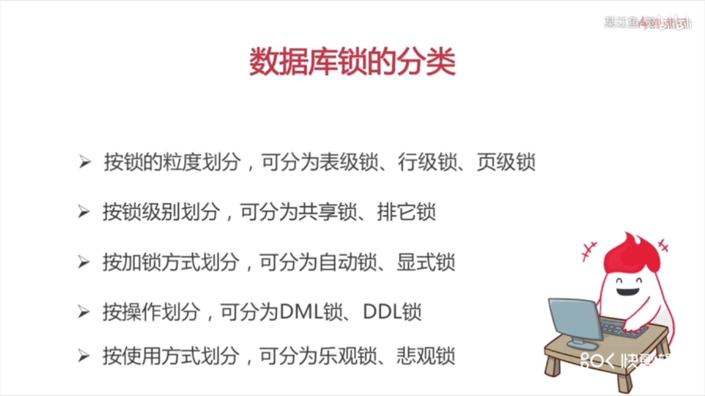

悲观锁

总是假设最坏的情况，每次去拿数据的时候都认为别人会修改，所以每次在拿数据的时候都会上锁，这样别人想拿这个数据就会阻塞直到它拿到锁（共享资源每次只给一个线程使用，其它线程阻塞，用完后再把资源转让给其它线程）。传统的关系型数据库里边就用到了很多这种锁机制，比如行锁，表锁等，读锁，写锁等，都是在做操作之前先上锁。Java中synchronized和ReentrantLock等独占锁就是悲观锁思想的实现。（适用于多写的情况**synchronized是悲观锁**）

乐观锁

总是假设最好的情况，每次去拿数据的时候都认为别人不会修改，所以不会上锁，但是在更新的时候会判断一下在此期间别人有没有去更新这个数据，可以使用版本号机制和CAS算法实现。乐观锁适用于多读的应用类型，这样可以提高吞吐量，像数据库提供的类似于write_condition机制，其实都是提供的乐观锁。在Java中java.util.concurrent.atomic包下面的原子变量类就是使用了乐观锁的一种实现方式CAS实现的。（适用于多读的情况）

### DML、DDL、DCL的区别：

**DML**（data manipulation language）数据操纵语言：就是我们最经常用到的
SELECT、UPDATE、INSERT、DELETE。

**DDL**（data definition language）数据库定义语言：

其实就是我们在创建表的时候用到的一些sql，比如说：CREATE、ALTER、DROP等。DDL主要是用在定义或改变表的结构，数据类型，表之间的链接和约束等初始化工作上。

**DCL**（Data Control Language）数据库控制语言：

是用来设置或更改数据库用户或角色权限的语句，包括（grant,deny,revoke等）语句。这个比较少用到。

### 死锁：

死锁是指两个或两个以上的进程在执行过程中，由于竞争资源或者由于彼此通信而造成的一种阻塞的现象，若无外力作用，它们都将无法推进下去。

#### 必要条件

**互斥条件**

**请求与保持条件**

**不可剥夺条件**

**循环等待条件**

#### **避免死锁**

1.破坏“不可剥夺”条件：一个进程不能获得所需要的全部资源时便处于等待状态，等待期间他占有的资源将被隐式的释放重新加入到系统的资源列表中，可以被其他的进程使用，而等待的进程只有重新获得自己原有的资源以及新申请的资源才可以重新启动，执行。

2.破坏”请求与保持条件“：第一种方法静态分配即每个进程在开始执行时就申请他所需要的全部资源。第二种是动态分配即每个进程在申请所需要的资源时他本身不占用系统资源。

3.破坏“循环等待”条件：采用资源有序分配其基本思想是将系统中的所有资源顺序编号，将紧缺的，稀少的采用较大的编号，在申请资源时必须按照编号的顺序进行，一个进程只有获得较小编号的进程才能申请较大编号的进程。

### 数据库优化：

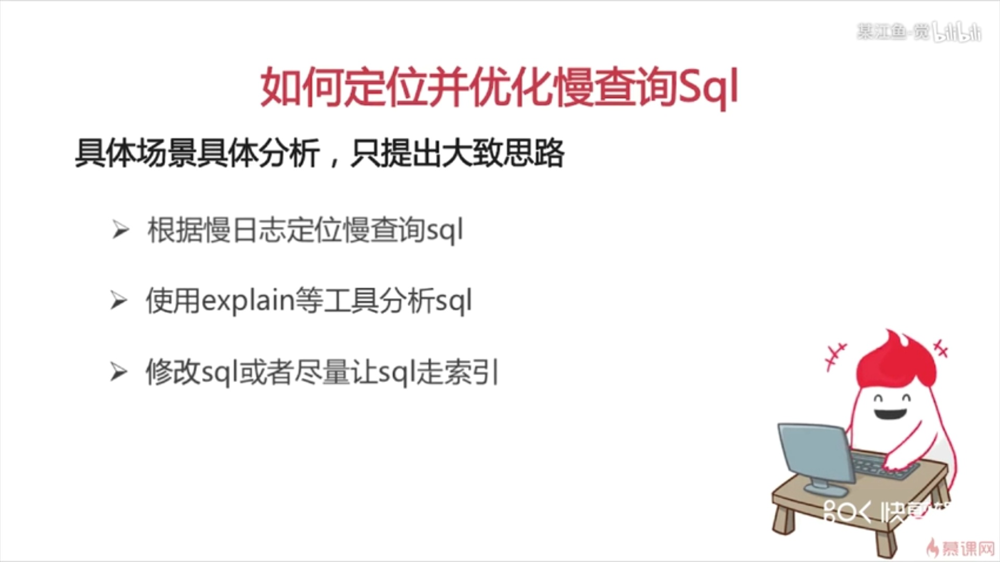

查看数据库慢日志：

slow_query_log    ：是否开启慢查询日志，1表示开启，0表示关闭。

log-slow-queries 
：旧版（5.6以下版本）MySQL数据库慢查询日志存储路径。可以不设置该参数，系统则会默认给一个缺省的文件host_name-slow.log

slow-query-log-file：新版（5.6及以上版本）MySQL数据库慢查询日志存储路径。可以不设置该参数，系统则会默认给一个缺省的文件host_name-slow.log

/usr/local/mysql/data/localhost-slow.log （mysql慢日志路径）

### 索引：

**B+树：**

<https://blog.csdn.net/qq_26222859/article/details/80631121>

类似与书的目录，加快检索速度，但降低了修改效率。以mysql为例，数据索引是以B+数的方式存储，查询自然是log级别的时间复杂度。当进行增删改时，由于数据被修改，但为了使B+数继续保持平衡，就需要做结构上的改变，所以，相对会更慢。

**聚集索引与非聚集索引：**

一个表存在主键，主键为索引的方式存储为平衡树时，就是聚集索引。

非聚集索引和聚集索引一样，
同样是采用平衡树作为索引的数据结构。索引树结构中各节点的值来自于表中的索引字段，
假如给user表的name字段加上索引 ，
那么索引就是由name字段中的值构成，在数据改变时，
DBMS需要一直维护索引结构的正确性。如果给表中多个字段加上索引 ，
那么就会出现多个独立的索引结构，每个索引（非聚集索引）互相之间不存在关联。
因此，创建多个索引会加大空间的开销。


**区别：**

非聚集索引和聚集索引的区别在于， 通过聚集索引可以查到需要查找的数据，
而通过非聚集索引可以查到记录对应的主键值 ，
再使用主键的值通过聚集索引查找到需要的数据

**建立索引：**

例：create index index_birthday on user_info(birthday);

### 存储引擎：

#### 一.InnoDB存储引擎

InnoDB给MySQL的表提供了**事务**处理、回滚、崩溃修复能力和多版本并发控制的事务安全。在MySQL从3.23.34a开始包含InnnoDB。它是MySQL上第一个提供外键约束的表引擎。而且InnoDB对事务处理的能力，也是其他存储引擎不能比拟的。靠后版本的MySQL的默认存储引擎就是InnoDB。

InnoDB存储引擎总支持**AUTO_INCREMENT**。自动增长列的值不能为空，并且值必须唯一。MySQL中规定自增列必须为主键。在插入值的时候，如果自动增长列不输入值，则插入的值为自动增长后的值；如果输入的值为0或空（NULL），则插入的值也是自动增长后的值；如果插入某个确定的值，且该值在前面没有出现过，就可以直接插入（此后id自增也就从新的键值开始自增）。

InnoDB还支持**外键**（FOREIGN KEY）。外键所在的表叫做子表，外键所依赖（REFERENCES）的表叫做父表。父表中被字表外键关联的字段必须为主键。当删除、更新父表中的某条信息时，子表也必须有相应的改变，这是数据库的参照完整性规则。

InnoDB中，创建的表的表结构存储在.frm文件中（我觉得是frame的缩写吧）。数据和索引存储在innodb_data_home_dir和innodb_data_file_path定义的表空间中。

InnoDB的优势在于提供了良好的事务处理、崩溃修复能力和并发控制。缺点是读写效率较差，占用的数据空间相对较大。

#### 二.MyISAM存储引擎

MyISAM是MySQL中常见的存储引擎，曾经是MySQL的默认存储引擎。MyISAM是基于ISAM引擎发展起来的，增加了许多有用的扩展。

MyISAM的表存储成3个文件。文件的名字与表名相同。拓展名为frm、MYD、MYI。其实，frm文件存储表的结构；MYD文件存储数据，是MYData的缩写；MYI文件存储索引，是MYIndex的缩写。

基于MyISAM存储引擎的表支持3种不同的存储格式。包括静态型、动态型和压缩型。其中，静态型是MyISAM的默认存储格式，它的字段是固定长度的；动态型包含变长字段，记录的长度不是固定的；压缩型需要用到myisampack工具，占用的磁盘空间较小。

MyISAM的优势在于占用空间小，处理速度快。缺点是不支持事务的完整性和并发性。

#### 三.MEMORY存储引擎

MEMORY是MySQL中一类特殊的存储引擎。它使用存储在内存中的内容来创建表，而且数据全部放在内存中。这些特性与前面的两个很不同。

每个基于MEMORY存储引擎的表实际对应一个磁盘文件。该文件的文件名与表名相同，类型为frm类型。该文件中只存储表的结构。而其数据文件，都是存储在内存中，这样有利于数据的快速处理，提高整个表的效率。值得注意的是，服务器需要有足够的内存来维持MEMORY存储引擎的表的使用。如果不需要了，可以释放内存，甚至删除不需要的表。

MEMORY默认使用哈希索引。速度比使用B型树索引快。当然如果你想用B型树索引，可以在创建索引时指定。

注意，MEMORY用到的很少，因为它是把数据存到内存中，如果内存出现异常就会影响数据。如果重启或者关机，所有数据都会消失。因此，基于MEMORY的表的生命周期很短，一般是一次性的。

#### MYSIAM与INNODB：

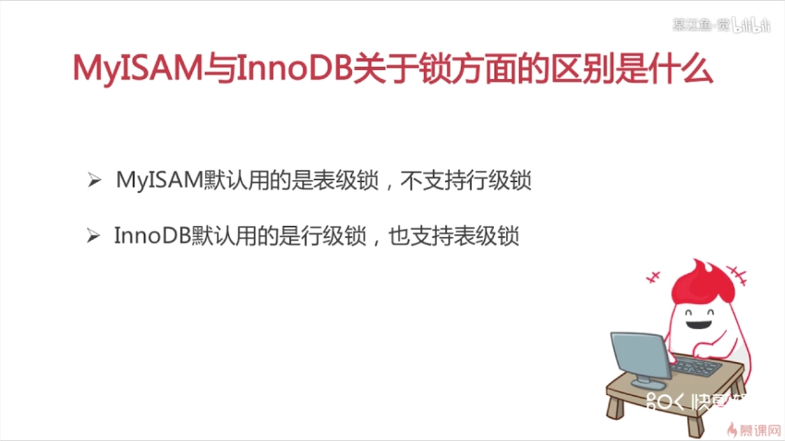

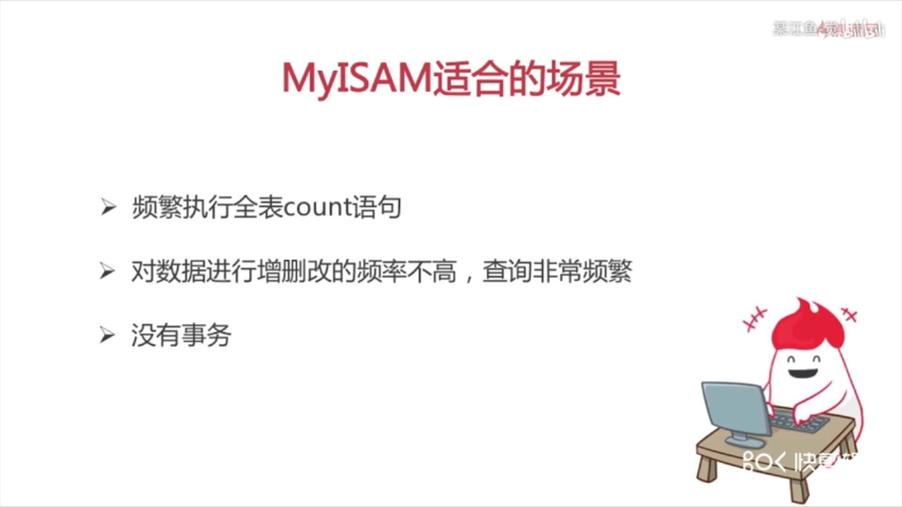

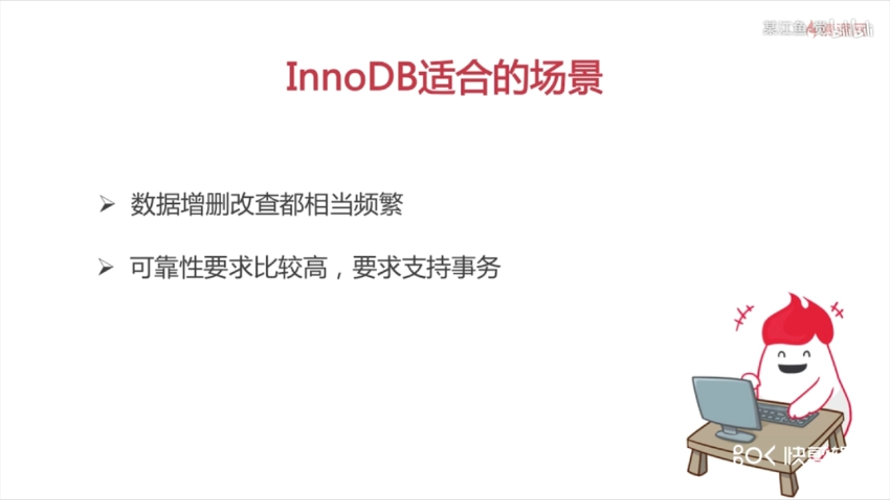

**为表创建自定义引擎：**

**例子：**

create table test(

id int(10) unsigned not null auto_increment,

name varchar(10) character set utf8,

age int(10),

primary key(id)

)

engine=MyISAM;

### **Mvcc**（Multi-Version Concurrency Control）

多版本并发控制。MVCC 是一种并发控制的方法，一般在数据库管理系统中，实现对数据库的并发访问；在编程语言中实现事务内存。如果有人从数据库中读数据的同时，有另外的人写入数据，有可能读数据的人会看到『半写』或者不一致的数据。有很多种方法来解决这个问题，叫做并发控制方法。最简单的方法，通过加锁，让所有的读者等待写者工作完成，但是这样效率会很差。MVCC 使用了一种不同的手段，每个连接到数据库的读者，**在某个瞬间看到的是数据库的一个快照**，写者写操作造成的变化在写操作完成之前（或者数据库事务提交之前）对于其他的读者来说是不可见的。

当一个 MVCC 数据库需要更一个一条数据记录的时候，它不会直接用新数据覆盖旧数据，而是将旧数据标记为过时（obsolete）并在别处增加新版本的数据。这样就会有存储多个版本的数据，但是只有一个是最新的。这种方式允许读者读取在他读之前已经存在的数据，即使这些在读的过程中半路被别人修改、删除了，也对先前正在读的用户没有影响。这种多版本的方式避免了填充删除操作在内存和磁盘存储结构造成的空洞的开销，但是需要系统周期性整理（sweep through）以真实删除老的、过时的数据。对于面向文档的数据库（Document-oriented database，也即半结构化数据库）来说，这种方式允许系统将整个文档写到磁盘的一块连续区域上，当需要更新的时候，直接重写一个版本，而不是对文档的某些比特位、分片切除，或者维护一个链式的、非连续的数据库结构。

1. ```
   一句话讲，MVCC就是用 **同一份数据临时保留多版本的方式** 的方式，实现并发控制。
   
   这里留意到 MVCC 关键的两个点：
   
   1. 在读写并发的过程中如何实现多版本；
   2. 在读写并发之后，如何实现旧版本的删除（毕竟很多时候只需要一份最新版的数据就够了）；
   ```

   

### Spring创建事务：

1.事务管理器注入datasource

2.事务详情（通知）传播行为与隔离级别

3.AOP

### 注意：

1 @Transactional 只能被应用到public方法上,
对于其它非public的方法,如果标记了@Transactional也不会报错,但方法没有事务功能.

2用 spring事务管理器,由spring来负责数据库的打开,提交,回滚.默认遇到运行期例外(throw new
RuntimeException("注释");)会回滚，即遇到不受检查（unchecked）的例外时回滚；而遇到需要捕获的例外(throw new Exception("注释");)不会回滚,即遇到受检查的例外（就是非运行时抛出的异常，编译器会检查到的异常叫受检查例外或说受检查异常）时，需我们指定方式来让事务回滚
要想所有异常都回滚,要加上 @Transactional(rollbackFor={Exception.class,其它异常}) .如果让unchecked例外不回滚：@Transactional(notRollbackFor=RunTimeException.class) 如下:
@Transactional(rollbackFor=Exception.class) //指定回滚,遇到异常Exception时回滚
public void methodName() { throw new Exception("注释");

}
@Transactional(noRollbackFor=Exception.class)//指定不回滚,遇到运行期例外(throw
new RuntimeException("注释");)会回滚 public ItimDaoImpl getItemDaoImpl() { throw
new RuntimeException("注释"); }

3、@Transactional 注解应该只被应用到 public 可见度的方法上。 如果你在
protected、private 或者 package-visible 的方法上使用 \@Transactional
注解，它也不会报错， 但是这个被注解的方法将不会展示已配置的事务设置。

4、@Transactional 注解可以被应用于接口定义和接口方法、类定义和类的 public
方法上。然而，请注意仅仅 \@Transactional 注解的出现不足于开启事务行为，它仅仅
是一种元数据，能够被可以识别 \@Transactional
注解和上述的配置适当的具有事务行为的beans所使用。上面的例子中，其实正是
\<tx:annotation-driven/\>元素的出现 开启 了事务行为。

5、Spring团队的建议是你在具体的类（或类的方法）上使用 @Transactional
注解，而不要使用在类所要实现的任何接口上。你当然可以在接口上使用 @Transactional
注解，但是这将只能当你设置了基于接口的代理时它才生效。因为注解是 不能继承
的，这就意味着如果你正在使用基于类的代理时，那么事务的设置将不能被基于类的代理所识别，而且对象也将不会被事务代理所包装（将被确认为严重的）。因此，请接受Spring团队的建议并且在具体的类上使@Transactional 注解。

Redis
-----

Redis的的是完全开源免费的，遵守BSD协议，是一个高性能的键值数据库。是当前最热门的的的NoSql数据库之一，也被人们称为数据结构服务器。

redis的优势：1，运行在内存，速度快官方号称支持并发11瓦特读操作，并发8瓦特写操作，可以说是相当彪悍了。

2，数据虽在内存，但是提供了持久化的支持，即可以将内存中的数据异步写入到硬盘中，同时不影响继续提供服务

3，支持数据结构丰富（string（字符串），list（链表），set（集合），zset（sorted
set - 有序集合））和Hash（哈希类型，md5加密出来的那个串）

### 为什么redis是单线程的？

redis 核心就是 如果我的数据全都在内存里，我单线程的去操作就是效率最高的，为什么呢，因为多线程的本质就是 CPU模拟出来多个线程的情况，这种模拟出来的情况就有一个代价，就是上下文的切换，对于一个内存的系统来说，它没有上下文的切换就是效率最高的。redis用单个CPU绑定一块内存的数据，然后针对这块内存的数据进行多次读写的时候，都是在一个CPU上完成的，所以它是单线程处理这个事。在内存的情况下，这个方案就是最佳方案。

### Redis的Java客户端

Redisson,Jedis，lettuce等等，官方推荐使用Redisson。

### Jedis与Redisson对比

#### 概况对比

Jedis是Redis的Java实现的客户端，其API提供了比较全面的Redis命令的支持；Redisson实现了分布式和可扩展的Java数据结构，和Jedis相比，功能较为简单，不支持字符串操作，不支持排序、事务、管道、分区等Redis特性。Redisson的宗旨是促进使用者对Redis的关注分离，从而让使用者能够将精力更集中地放在处理业务逻辑上。

#### 编程模型

Jedis中的方法调用是比较底层的暴露的Redis的API，也即Jedis中的Java方法基本和Redis的API保持着一致，了解Redis的API，也就能熟练的使用Jedis。而Redisson中的方法则是进行比较高的抽象，每个方法调用可能进行了一个或多个Redis方法调用。

如下分别为Jedis和Redisson操作的简单示例：

Jedis设置key-value与set操作：

Jedis jedis = …;

jedis.set("key", "value");

List\<String\> values = jedis.mget("key", "key2", "key3");

Redisson操作map：

Redisson redisson = …

RMap map = redisson.getMap("my-map"); // implement java.util.Map

map.put("key", "value");

map.containsKey("key");

map.get("key");

#### 可伸缩性

Jedis使用阻塞的I/O，且其方法调用都是同步的，程序流需要等到sockets处理完I/O才能执行，不支持异步。Jedis客户端实例不是线程安全的，所以需要通过连接池来使用Jedis。

Redisson使用非阻塞的I/O和基于Netty框架的事件驱动的通信层，其方法调用是异步的。Redisson的API是线程安全的，所以可以操作单个Redisson连接来完成各种操作。

#### 数据结构

Jedis仅支持基本的数据类型如：String、Hash、List、Set、Sorted Set。

Redisson不仅提供了一系列的分布式Java常用对象，基本可以与Java的基本数据结构通用，还提供了许多分布式服务，其中包括（BitSet,
Set, Multimap, SortedSet, Map, List, Queue, BlockingQueue, Deque, BlockingDeque,
Semaphore, Lock, AtomicLong, CountDownLatch, Publish / Subscribe, Bloom filter,
Remote service, Spring cache, Executor service, Live Object service, Scheduler
service）。

在分布式开发中，Redisson可提供更便捷的方法。

### redisson实现分布式锁

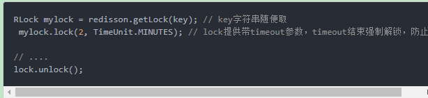

缺陷

因为是redis-cluster，这个kv会被异步复制给其他节点。但是在这过程中主节点挂了，还没来得及复制。虽然客户端1以为加锁成功了，其实这个key已经丢失。

主备切换后，客户端2也来加锁，也成功了，这样就导致了多个客户端对一个分布式锁完成了加锁，可能会造成脏数据。

### 缓存与数据库一致性问题

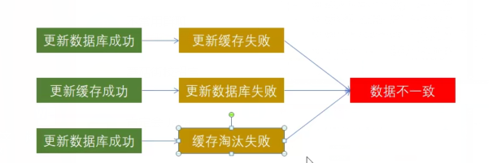

产生不一致问题（当要写更新数据库时）：

1.  先更新数据库，在删除缓存

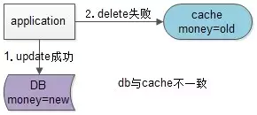

>   image

1.  先删除缓存再更新数据库（更好）

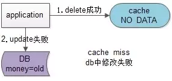

>   image

>   **结论：先淘汰缓存，再写数据库。**

3 并发情况下（分布式锁？）

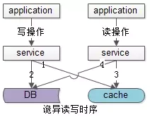

**解决方案：**

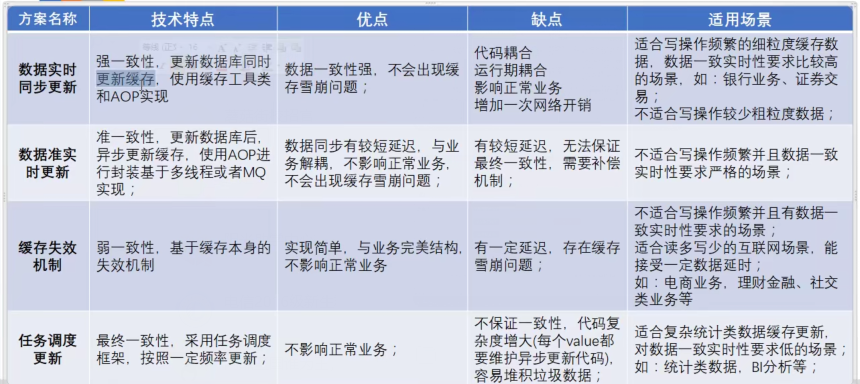

### 数据持久化

#### Rdb

**RDB的优点：**

对性能影响最小。如前文所述，Redis在保存RDB快照时会fork出子进程进行，几乎不影响Redis处理客户端请求的效率。每次快照会生成一个完整的数据快照文件，所以可以辅以其他手段保存多个时间点的快照（例如把每天0点的快照备份至其他存储媒介中），作为非常可靠的灾难恢复手段。使用RDB文件进行数据恢复比使用AOF要快很多。

**RDB的缺点：**

快照是定期生成的，所以在Redis
crash时或多或少会丢失一部分数据。如果数据集非常大且CPU不够强（比如单核CPU），Redis在fork子进程时可能会消耗相对较长的时间，影响Redis对外提供服务的能力。

#### Aof

**AOF的优点：**

最安全，在启用appendfsync always时，任何已写入的数据都不会丢失，使用在启用appendfsync everysec也至多只会丢失1秒的数据。AOF文件在发生断电等问题时也不会损坏，即使出现了某条日志只写入了一半的情况，也可以使用redis-check-aof工具轻松修复。AOF文件易读，可修改，在进行了某些错误的数据清除操作后，只要AOF文件没有rewrite（此功能可以防止文件过大），就可以把AOF文件备份出来，把错误的命令删除，然后恢复数据。

**AOF的缺点：**

AOF文件通常比RDB文件更大性能消耗比RDB高数据恢复速度比RDB慢

### 驱逐策略

达到最大内存限制时(maxmemory), Redis 根据 maxmemory-policy 配置的策略,
来决定具体的行为。

当前版本,Redis 3.0 支持的策略包括:

**noeviction**: 不删除策略, 达到最大内存限制时, 如果需要更多内存,
直接返回错误信息。 大多数写命令都会导致占用更多的内存(有极少数会例外, 如 DEL )。

**allkeys-lru**: 所有key通用; 优先删除最近最少使用(less recently used ,LRU) 的
key。

**volatile-lru**: 只限于设置了 expire 的部分; 优先删除最近最少使用(less recently
used ,LRU) 的 key。

**allkeys-random**: 所有key通用; 随机删除一部分 key。

**volatile-random**: 只限于设置了 expire 的部分; 随机删除一部分 key。

**volatile-ttl**: 只限于设置了 expire 的部分; 优先删除剩余时间(time to live,TTL)
短的key。

### 内存优化

### 常见的性能问题 
